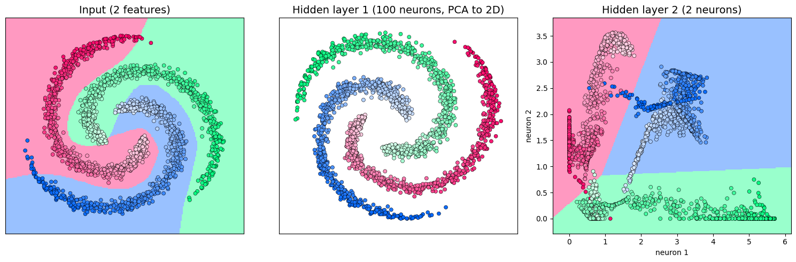
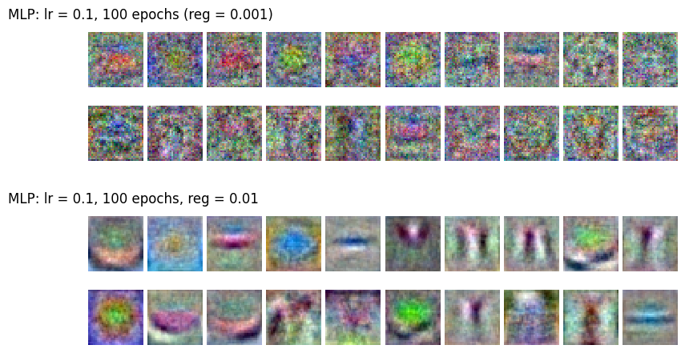

# HW 1 - Classification

This repository contains the first homework assignment for
[Deep Learning Essentials (BECM33DPL)](https://cw.fel.cvut.cz/wiki/courses/becm33dpl/start).
The assignment introduces classification through k-nearest neighbors, linear classifiers, and neural networks.

See the [HW 1 course page](https://cw.fel.cvut.cz/wiki/courses/becm33dpl/tutorials/hw1) for assignment details.

## Sections

- [HW 1 - Classification](#hw-1---classification)
  - [Sections](#sections)
  - [What will you learn?](#what-will-you-learn)
  - [Getting started](#getting-started)
  - [Working on the Assignments](#working-on-the-assignments)
  - [How to submit](#how-to-submit)

## What will you learn?

You will implement three classifiers from scratch, each one a step further than the previous: k-nearest neighbors,
a linear classifier and a multi-layer perceptron (MLP). You will first try each of them on 2D toy data, where you can
see exactly what they do, and then on real images from [CIFAR-10](https://www.cs.toronto.edu/~kriz/cifar.html),
where they reach roughly 30–35%, 40% and 50% accuracy. Along the way you will learn the following:

- ### k-Nearest Neighbors and Cross-Validation

k-NN classifies a point by the labels of its closest training points. You will implement it with loops and then
vectorized with NumPy, and choose its hyperparameter k with cross-validation: the training data is split into folds,
and every fold is used once for validation while the others are used for training.

<div align="center">
    
    <hr>
</div>

- ### Linear Classifier: The Fundamental Building Block

A linear classifier gives every class a score $s = xW + b$ and predicts the class with the highest one. You will train
it with softmax cross-entropy, L2 regularization and stochastic gradient descent, and look at it from two angles:

<div align="center">
    <h4>Geometric Perspective: straight decision boundaries</h4>
    
    
    <br>
    <br>
    <h4>Template Matching Perspective: one template image per class</h4>
    
    <hr>
</div>

You will also see where it fails: data that no straight line can separate, and objects that appear at a different
size than in the template.

- ### Neural Network Classifier: Learning Features

An MLP stacks linear layers with non-linear activation functions in between. You will implement one with two hidden
layers and see that it solves the spiral dataset, which no linear classifier can.

<div align="center">
    <h4>Complex Decision Boundaries of Neural Networks</h4>
    
    
</div>

You will compare the ReLU, tanh and sigmoid activation functions, and see why an MLP without any activation is
still just a linear classifier.

<div align="center">
    <h4>Activation Functions</h4>
    
</div>

Then you will look inside the trained network: its hidden layers move the points until every spiral arm lies in its
own part of the plane, where the last layer, a plain linear classifier, separates them with straight lines.

<div align="center">
    <h4>How the Hidden Layers Untwist the Spirals</h4>
    
</div>

Finally, you will train the MLP on CIFAR-10. Its first layer learns hundreds of image templates instead of one per
class, which is why it beats the linear classifier. You will tune the hyperparameters yourself (learning rate,
regularization, layer sizes, number of epochs), learn to recognize overfitting in the training curves, and report
what you found.

<div align="center">
    <h4>First-Layer Templates of an MLP, with Weak and Strong Regularization</h4>
    
</div>

## Getting started

To be able to start with the assignments, follow these simple steps:

1. **Clone the Repository**: Start by cloning this repository to your local computer. Use the following command in your
   terminal:

    ```shell
    git clone https://github.com/jskvrna/DPL-HW1.git
    cd DPL-HW1
    ```

2. **Install System Dependencies**: Before proceeding, ensure that you have the following system dependencies installed:

    - `python==3.12`
    - `python3-pip`
    - `wget`
    - `tar`
    - `zip`

3. **Install Python Dependencies**: In your environment, you need to have Python 3.12 installed. Then you can run 

    ```bash
    pip install -r requirements.txt
    ```

    Then install PyTorch for your machine by following the [PyTorch installation instructions](https://pytorch.org/get-started/locally/).
    A GPU is not needed: the whole homework runs on a laptop CPU. If you have an NVIDIA GPU (CUDA) or an Apple
    silicon Mac (MPS), `mlp_part_2.ipynb` trains on it automatically, but it only pays off for large networks.
    `MLPClassifier` also accepts `device="cuda"`, `"mps"` or `"cpu"` directly.

    From the repository root (`DPL-HW1`), install the homework package (`hw1`) by running:

    ```shell
    pip install -e .
    ```
   
4. **Check Your Installation**: To verify that the installation was successful, run the following command in your
   terminal:

    ```shell
    hw1-test-env
    ```

    If the installation was successful, you should see a message indicating that the tests passed. If you encounter any
    issues, please reach out to the teaching assistants for assistance.
    
    ```shell
    $ hw1-test-env 
    INFO: Environment is correctly set up.
    ```
   
5. **Choose Your IDE**: We recommend Visual Studio Code (VS Code), but you are welcome to use your preferred
   Integrated Development Environment (IDE).

The CIFAR-10 dataset (about 170 MB) is downloaded automatically into `data/datasets/CIFAR10` the first time a notebook
needs it.

## Working on the Assignments

> We encourage you to write the assignment code yourself without using AI tools to fill it in. Reading the
> documentation and experimenting with your own implementation will give you deeper insight into how the methods
> work. :)

The homework is divided into six notebooks in the project's root directory. Work through them in this order, as each
one builds on the previous ones:

| # | Notebook | What you do | File to edit | Autograded assignments |
|---|---|---|---|---|
| 1 | [Introduction to k-Nearest Neighbors](knn_part_1.ipynb) | Implement k-NN with NumPy: distances with loops, prediction, vectorized distances | `knn_classifier.py` | 1.1 (0.5 pt), 1.2 (1 pt), 1.3 (1 pt) |
| 2 | [k-NN: Hyperparameter Tuning](knn_part_2.ipynb) | Apply k-NN to CIFAR-10, implement cross-validation, **answer two questions** in the notebook | `tuning.py` | 2.1 (1 pt) |
| 3 | [Linear Classifiers: Part 1](linear_part_1.ipynb) | Implement the scores, prediction, loss and gradient-descent step; explore decision boundaries, learning rate and regularization | `linear_classifier.py` | 3.1 (0.5 pt), 3.2 (0.5 pt), 3.3 (1 pt), 3.4 (1 pt) |
| 4 | [Linear Classifiers: Part 2](linear_part_2.ipynb) | Nothing new to implement: train your linear classifier on CIFAR-10 and study its templates | – | – |
| 5 | [Multi-Layer Perceptrons: Part 1](mlp_part_1.ipynb) | Implement the forward pass, prediction, loss and gradient-descent step of an MLP; explore activations and hidden features | `mlp_classifier.py` | 4.1–4.4 (0.5 pt each) |
| 6 | [Multi-Layer Perceptrons: Part 2](mlp_part_2.ipynb) | Nothing new to implement: **tune the hyperparameters** of your MLP on CIFAR-10 and **write a short report** in the notebook | – | – |

The autograded assignments give 8.5 points in total. The answers in `knn_part_2.ipynb` and the report in
`mlp_part_2.ipynb` are part of your submission as well.

Inside each notebook, you will find task descriptions and the specific files you need to modify. These editable files
are situated in the `src/assignments` directory. Every assignment in these files lists the shapes of the inputs and
outputs and gives hints. Please refrain from altering any other files. Within these designated files, make changes
only to sections resembling the following:

```python
# ▰▱▰▱▰▱▰▱▰▱▰▱▰▱▰▱▰▱▰▱▰▱▰▱ Assignment 1.1 ▰▱▰▱▰▱▰▱▰▱▰▱▰▱▰▱▰▱▰▱▰▱▰▱▰ #
# TODO:                                                             #
# Calculate the L2 distance between the ith test point and the jth  #
# training point and store the result in dists[i, j]. Avoid using   #
# loops over dimensions or np.linalg.norm().                        #
# ▰▱▰▱▰▱▰▱▰▱▰▱▰▱▰▱▰▱▰▱▰▱▰▱▰▱▰▱▰▱▰▱▰▱▰▱▰▱▰▱▰▱▰▱▰▱▰▱▰▱▰▱▰▱▰▱▰▱▰▱▰▱▰▱▰ #
# 🌀 INCEPTION 🌀 (Your code begins its journey here. 🚀 Do not delete this line.)
#
#                    ╔═══════════════════════╗
#                    ║                       ║
#                    ║       YOUR CODE       ║
#                    ║                       ║
#                    ╚═══════════════════════╝
#
# 🌀 TERMINATION 🌀 (Your code reaches its end. 🏁 Do not delete this line.)
```

Remember, any modifications outside of this designated section can cause the autograder to fail, resulting in a
suboptimal grade. If you have any questions, please reach out to the teaching assistants.

To test your code, you can run the following command in your terminal:

```shell
hw1-test-assignments
```

It checks every assignment against reference outputs and reports which ones pass. Run it before training in the
notebooks: a wrong shape or a missing term in the loss is much easier to find here than in a training curve.

## How to submit

Before submitting, run every notebook from top to bottom and save it, so that your outputs, plots, answers and
report are included.

Once you've completed the assignment and are ready to submit your work, use the following command in your terminal:

```shell
hw1-submit
```

This will create a zip file named `hw1.zip` in the project's root directory. It contains your `src/assignments`
folder and all six notebooks, also converted to HTML. Submit this file to
the HW 1 assignment for Deep Learning Essentials (BECM33DPL) in
[BRUTE](https://cw.felk.cvut.cz/brute/student/).
